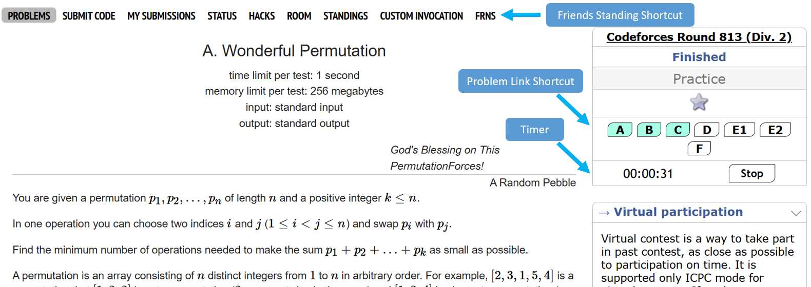

# CF ToolKit

1. Problem Timer
2. Problem Link Shortcut in statement Page
3. Friends Standing Shortcut

*Refresh or exit won't affect the timer. Stop button don't pauses the Timer . Only stops to show you the last time.* 

*Problem Link will be highlighted based on Accepted or Rejected.* 

### How To Use 

---

1. Install Tampermonkey extension from this [link](https://chromewebstore.google.com/detail/tampermonkey/dhdgffkkebhmkfjojejmpbldmpobfkfo)
2. Click Tampermonkey icon from the top bar , and click ``Create a new Script``
3. Paste the contents of script.js file in the Tampermonkey editor.
4. CTRL+S
5. ENJOY
